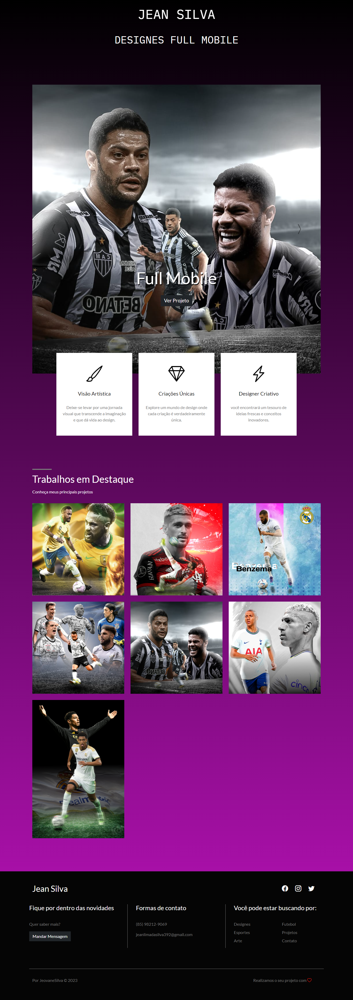
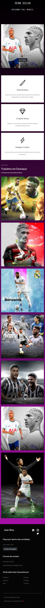

# Galeria de designs 🖼️​
✅​ Projeto Concluido

 

## ​​​​🖥️​ Desenvolvido por: 
<ul>
<li>Jeovane Lima</li>
<li>Disponível em: <a href="https://jeansilva.netlify.app/" target="_blank">Jean Designes</a></li>
</ul>

 

## ​⚒️​ Ferramentas Utilizadas:

 
 

<ul>
  <li>HTML</li>
  <li>CSS</li>
  <li>JavaScript</li>
  <li>Bootstrap</li>
</ul>

 

 
## 🖌️ ​Sobre o Projeto:

O projeto é uma galeria de Designs feito para expor as artes de <a href="https://www.instagram.com/jeann.244/" target="_blank"> Jean Lima </a> e que também serviu para meus treinamentos em HTML, CSS, JavaScript e Bootstrap.

 

## ​🔗 Imagens do Projeto:

 
<h1>Site Versão Desktop</h1>

 

<h1> Site Versão Mobile (Responsivo) </h1>

 

<h1>Tela Mandar Mensagem</h1>

 

## ​🚨Importante:
<ul>
<li>Imagens Criadas no Mobile</li>

<li>As fontes utilizadas foram <a href="https://fonts.google.com/specimen/IBM+Plex+Mono?query=ibm+" target="_blank">IBM Plex Mono</a> e <a href="https://fonts.google.com/specimen/Lato?query=lato" target="_blank">Lato</a>, ambas retiradas do <a href="https://fonts.google.com/" target="_blank">Google Fonts.</a> </li>

<li>Utilização do <a href="https://getbootstrap.com/docs/5.0/getting-started/introduction/" target="_blank">BOOTSTRAP 5</a></li>

<li>Icons retirados do <a href="https://icons.getbootstrap.com/" target="_blank">Bootstrap Icons.</a></li>
</ul>

<!--https://dev.to/envoy_/150-badges-for-github-pnk--!>
